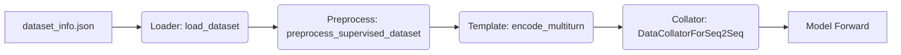
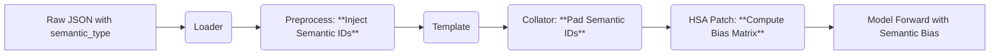

# LLaMA-Factory 原始架构与 HSA 深度集成方案

本文档旨在深入剖析 LLaMA-Factory 的原始数据流与架构，并在此基础上详细说明 HSA（分层语义注意力）机制是如何“侵入”并改造这一流程的。

---

## 1. LLaMA-Factory 原始架构全景

LLaMA-Factory 是一个基于 HuggingFace Transformers 的高效微调框架。其核心工作流可以概括为：**配置解析 -> 数据加载 -> 预处理 -> 模型初始化 -> 训练循环**。

### 1.1 原始数据流 (Data Flow)



#### 关键节点详解：

1.  **数据加载 (`src/llamafactory/data/loader.py`)**
    *   **功能**: 读取 `dataset_info.json`，加载原始数据（JSON/Arrow），统一列名为标准格式（`prompt`, `response`, `system`, `tools`）。
    *   **输出**: HuggingFace `Dataset` 对象，包含原始文本。

2.  **预处理 (`src/llamafactory/data/preprocess.py`)**
    *   **核心函数**: `preprocess_supervised_dataset`
    *   **功能**:
        *   调用 `Template.encode_multiturn` 将文本转换为 Token ID。
        *   构建 `labels`，对 User 输入部分进行 Mask (设为 -100)。
    *   **输出**: 包含 `input_ids`, `attention_mask`, `labels` 的 Dataset。

3.  **模板编码 (`src/llamafactory/data/template.py`)**
    *   **功能**: 负责将对话列表拼接成特定模型的格式（如 ChatML, Llama2 格式），添加特殊 Token (`<|im_start|>`, `<|im_end|>`)。

4.  **数据整理 (`src/llamafactory/data/collator.py`)**
    *   **核心类**: `DataCollatorForSeq2Seq`
    *   **功能**:
        *   **Padding**: 将 Batch 内不同长度的序列补齐（`input_ids` 补 `pad_token_id`，`labels` 补 -100）。
        *   **Attention Mask**: 生成标准的因果掩码（Causal Mask）。

5.  **模型加载 (`src/llamafactory/model/loader.py`)**
    *   **功能**: 加载预训练模型，应用 LoRA/QLoRA 适配器。

---

## 2. HSA 深度集成方案 (HSA Integration)

HSA 并非外挂模块，而是通过**侵入式修改 (Intrusive Modification)** 和 **运行时热补丁 (Runtime Monkey Patching)** 深度植入到上述流程中。

### 2.1 改造后的数据流



### 2.2 详细集成点对照表

| 阶段 | 原始 LLaMA-Factory 行为 | HSA 改造行为 | 修改文件 |
| :--- | :--- | :--- | :--- |
| **Input** | 仅读取 `content` 和 `role` | 读取 `content`, `role` **以及 `semantic_type`** | `preprocess.py` |
| **Tokenization** | `tokenizer.encode(text)` 生成 `input_ids` | 生成 `input_ids` 的同时，**广播 (Broadcast)** 语义标签生成 `semantic_ids` | `preprocess.py` |
| **Collation** | Pad `input_ids` (0), `labels` (-100) | 增加 **Pad `semantic_ids` (2=NOISE)** | `collator.py` |
| **Model Load** | 加载标准 `Qwen2VLForConditionalGeneration` | 加载模型后，**替换 Attention Layer 的 `forward` 方法** | `patcher.py`, `hsa_patch.py` |
| **Forward** | `Attention(Q, K, V)` | `Attention(Q, K, V + Bias(semantic_ids))` | `hsa_patch.py` |

---

## 3. 核心代码修改逻辑详解

### 3.1 预处理阶段：语义 ID 生成 (`preprocess.py`)

**原始逻辑**:
```python
# 伪代码
for msg in messages:
    ids = tokenizer.encode(msg["content"])
    input_ids.extend(ids)
```

**HSA 改造逻辑**:
我们需要解决**Token 对齐**问题。即：原始文本的一个词可能被切分为多个 Token，这些 Token 必须共享同一个语义标签。

```python
# 伪代码
for msg in messages:
    ids = tokenizer.encode(msg["content"])
    
    # 1. 获取该消息的语义类型 (默认为 NOISE)
    sem_type = SEMANTIC_MAP.get(msg.get("semantic_type"), NOISE)
    
    # 2. 广播: 长度必须与 ids 严格一致
    sem_ids = [sem_type] * len(ids)
    
    input_ids.extend(ids)
    semantic_ids.extend(sem_ids) # <--- 新增
```

### 3.2 整理阶段：噪声填充 (`collator.py`)

**原始逻辑**:
`DataCollatorForSeq2Seq` 会自动处理它认识的字段。对于不认识的字段，默认行为可能是不处理或报错。

**HSA 改造逻辑**:
我们需要显式告诉 Collator 如何处理 `semantic_ids`。关键点是 **Padding Value 必须是 NOISE (2)**。

```python
# 伪代码
if "semantic_ids" in features[0]:
    # 提取
    batch_sem_ids = [f["semantic_ids"] for f in features]
    # Padding
    padded_sem_ids = pad_sequence(batch_sem_ids, padding_value=2) # <--- 关键：填 2
    # 存回
    features["semantic_ids"] = padded_sem_ids
```
*   **为什么填 2?**
    *   在 HSA 矩阵计算中，类型 2 (NOISE) 会受到 $\lambda_2$ 的强衰减。
    *   Padding 部分本质上是无意义的，应当被模型“遗忘”或忽略。

### 3.3 模型阶段：计算图注入 (`hsa_patch.py`)

这是最核心的改动。我们不修改 Transformers 库源码，而是使用 Python 的动态特性。

**原始 Attention**:
```python
def forward(self, hidden_states, attention_mask=None, ...):
    # ...
    attn_weights = torch.matmul(query, key.transpose(-1, -2)) / math.sqrt(head_dim)
    if attention_mask is not None:
        attn_weights = attn_weights + attention_mask
    # ...
```

**HSA 注入后**:
```python
def hsa_forward(self, hidden_states, attention_mask=None, **kwargs):
    # 1. 拦截 semantic_ids
    semantic_ids = kwargs.get("semantic_ids")
    
    # 2. 计算 HSA Bias
    if semantic_ids is not None:
        hsa_bias = compute_hsa_bias(semantic_ids, ...) # N x N 矩阵
        
        # 3. 叠加 Bias
        if attention_mask is None:
            attention_mask = hsa_bias
        else:
            attention_mask = attention_mask + hsa_bias
            
    # 4. 调用原始逻辑
    return original_forward(self, hidden_states, attention_mask, **kwargs)
```

---

## 4. 总结

HSA 的集成方案是一个**全链路 (End-to-End)** 的改造：
1.  **数据层**: 负责生产“弹药” (`semantic_ids`)。
2.  **传输层**: 负责运输“弹药” (通过 Collator 和 Trainer 透传)。
3.  **模型层**: 负责使用“弹药” (计算 Bias 并干预 Attention)。

这种设计最大程度地保留了 LLaMA-Factory 的易用性（无需重写 Trainer），同时实现了深度的模型行为干预。
